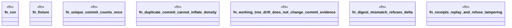

# `crates/ggen-cli/src/cmds/sbb/tests.rs`

Source SHA-256: `44a0bad9181352a4dc3a1a64431699dba1d4d7fa29981f55fae1ddfc485f5a8d`

## Dependencies

- `super::*`
- `super::evaluation::evaluate`

## Standing

- Structural parse: `ALIVE`
- Runtime behavior: `UNKNOWN`
