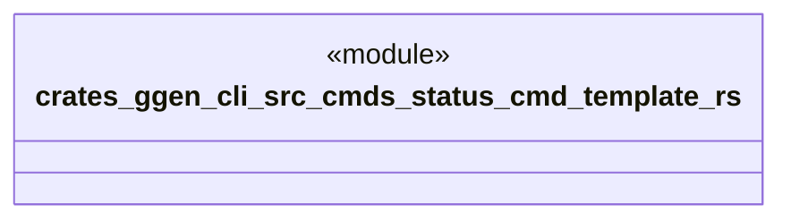

# `crates/ggen-cli/src/cmds/status_cmd_template.rs`

Source SHA-256: `4463a77f3fd552ddb29bad55e1df0cc3ab5e8635745de1dc9e55a00dd47623b5`

## Dependencies

- None observed.

## Standing

- Structural parse: `ALIVE`
- Runtime behavior: `UNKNOWN`
