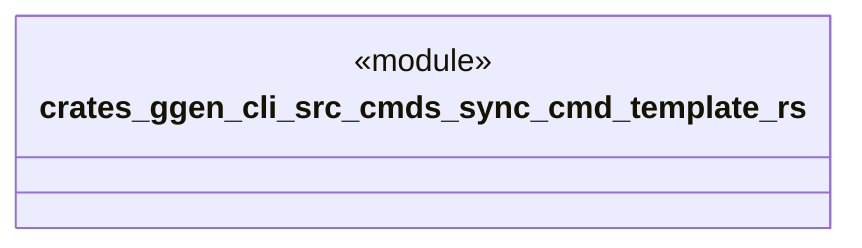

# `crates/ggen-cli/src/cmds/sync_cmd_template.rs`

Source SHA-256: `b8de796f244d12a481c64893b852575f18cf1ae8e18d1d152834fdc771b6c238`

## Dependencies

- None observed.

## Standing

- Structural parse: `ALIVE`
- Runtime behavior: `UNKNOWN`
