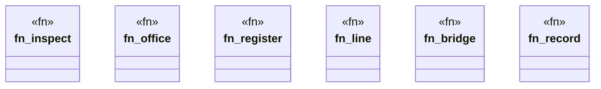

# `crates/ggen-cli/src/cmds/telco.rs`

Source SHA-256: `ed3a51cb7090b0bae0e3e498f41301212f8913bedbfa39b61ca375b7c1991cf0`

## Dependencies

- `clap_noun_verb::Result`
- `clap_noun_verb_macros::verb`
- `serde_json::Value`
- `std::path::Path`
- `super::maximalism`

## Standing

- Structural parse: `ALIVE`
- Runtime behavior: `UNKNOWN`
