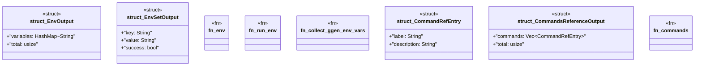

# `crates/ggen-cli/src/cmds/utils.rs`

Source SHA-256: `834eaaa58a3a3f95203f45ebf0278493fb739d9d3173de79d20450e035ab22b2`

## Dependencies

- `clap_noun_verb::Result`
- `clap_noun_verb_macros::verb`
- `serde::Serialize`
- `std::collections::HashMap`

## Standing

- Structural parse: `ALIVE`
- Runtime behavior: `UNKNOWN`
