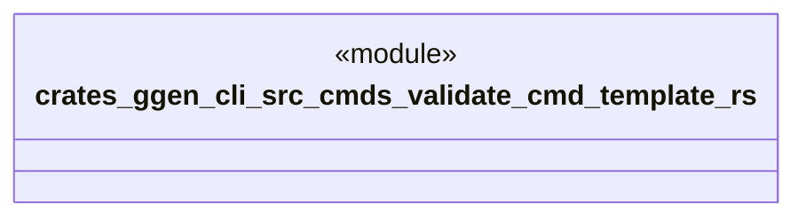

# `crates/ggen-cli/src/cmds/validate_cmd_template.rs`

Source SHA-256: `2c1264bf71139da648ff6a31eaf0a355a2af610b90f947b910ef5bbd5ad643a2`

## Dependencies

- None observed.

## Standing

- Structural parse: `ALIVE`
- Runtime behavior: `UNKNOWN`
