# `crates/ggen-cli/src/cmds/vision2030/evaluation.rs`

Source SHA-256: `3d72b0b2527298f9e7618dc7f5052056b7c1ca2208363dafdfbca622a870702b`

```mermaid
classDiagram
    class struct_Candidate {
      <<struct>>
      +"report: CapabilityReport"
      +"intrinsically_alive: bool"
      +"observed_any: bool"
      +"dependencies: Vec~String~"
    }
    class fn_hex64 {
      <<fn>>
    }
    class fn_expected_digest {
      <<fn>>
    }
    class fn_safe_locator {
      <<fn>>
    }
    class fn_evidence_path {
      <<fn>>
    }
    class fn_evidence_bytes {
      <<fn>>
    }
    class fn_parse_evidence {
      <<fn>>
    }
    class fn_unique_nonempty {
      <<fn>>
    }
    class fn_exact_evidence_keys {
      <<fn>>
    }
    class fn_multiplier {
      <<fn>>
    }
    class fn_load {
      <<fn>>
    }
    class fn_validate_sbb {
      <<fn>>
    }
    class fn_validate_authority {
      <<fn>>
    }
    class fn_evaluate_capability {
      <<fn>>
    }
    class fn_cycle_nodes {
      <<fn>>
    }
    class fn_refuse_duplicate_reports {
      <<fn>>
    }
    class fn_evaluate {
      <<fn>>
    }
    class fn_as_value {
      <<fn>>
    }
    class fn_validation {
      <<fn>>
    }
    class fn_roadmap {
      <<fn>>
    }
    class fn_blue_ocean {
      <<fn>>
    }
    class fn_lens_requirements {
      <<fn>>
    }
    class fn_lens {
      <<fn>>
    }
    class fn_remediation {
      <<fn>>
    }
    class fn_doctor {
      <<fn>>
    }
```

## Dependencies

- `super::*`

## Standing

- Structural parse: `ALIVE`
- Runtime behavior: `UNKNOWN`
