# `crates/ggen-cli/src/cmds/vision2030/mod.rs`

Source SHA-256: `d5d118a81ab5d05db7da8ee9d7323c08968965d9483dff79b8237464fadc067c`

```mermaid
classDiagram
    class mod_evaluation {
      <<mod>>
    }
    class mod_receipts {
      <<mod>>
    }
    class mod_tests {
      <<mod>>
    }
    class struct_Manifest {
      <<struct>>
      +"schema: String"
      +"program: Program"
      +"required_domains: Vec~String~"
      +"horizons: Vec~Horizon~"
      +"capabilities: Vec~Capability~"
    }
    class struct_Program {
      <<struct>>
      +"id: String"
      +"version: String"
      +"target_year: u16"
      +"phase_change_target: u64"
      +"trusted_issuers: BTreeMap~String"
      +"trusted_brokers: BTreeMap~String"
    }
    class struct_Horizon {
      <<struct>>
      +"year: u16"
      +"minimum_alive_capabilities: usize"
    }
    class struct_Capability {
      <<struct>>
      +"id: String"
      +"iri: String"
      +"domain: String"
      +"horizon: u16"
      +"blue_ocean_move: String"
      +"authority: String"
      +"summary: String"
      +"dependencies: Vec~String~"
      +"evidence: BTreeMap~String"
    }
    class struct_Evidence {
      <<struct>>
      +"locator: String"
      +"digest: String"
    }
    class struct_SbbIdentity {
      <<struct>>
      +"id: String"
      +"version: String"
      +"architecture_contract: String"
      +"minimum_commit_equivalent_units: u64"
    }
    class struct_SbbDeltaReport {
      <<struct>>
      +"id: String"
      +"commit: String"
      +"observed: bool"
      +"violations: Vec~String~"
    }
    class struct_SbbReport {
      <<struct>>
      +"schema: String"
      +"manifest_digest: String"
      +"sbb: SbbIdentity"
      +"standing: String"
      +"claim_ceiling: String"
      +"target_met: bool"
      +"eligible_for_external_admission: bool"
      +"declared_deltas: usize"
      +"commit_equivalent_units: usize"
      +"duplicate_commit_collisions: usize"
      +"axes: BTreeMap~String"
      +"distribution_contexts: String"
      +"delivered_capability_instances: String"
      +"deltas: Vec~SbbDeltaReport~"
      +"violations: Vec~String~"
      +"report_digest: String"
    }
    class struct_SbbReportBody {
      <<struct>>
      +"schema: &'static str"
      +"manifest_digest: &'a str"
      +"sbb: &'a SbbIdentity"
      +"standing: &'a str"
      +"claim_ceiling: &'a str"
      +"target_met: bool"
      +"eligible_for_external_admission: bool"
      +"declared_deltas: usize"
      +"commit_equivalent_units: usize"
      +"duplicate_commit_collisions: usize"
      +"axes: &'a BTreeMap~String"
      +"distribution_contexts: &'a str"
      +"delivered_capability_instances: &'a str"
      +"deltas: &'a [SbbDeltaReport]"
      +"violations: &'a [String]"
    }
    class struct_SbbReceipt {
      <<struct>>
      +"schema: String"
      +"operation: String"
      +"manifest_digest: String"
      +"report_digest: String"
      +"previous_digest: String"
      +"artifacts: Vec~String~"
      +"digest_algorithm: String"
      +"digest: String"
    }
    class struct_SbbReceiptBody {
      <<struct>>
      +"schema: &'static str"
      +"operation: &'a str"
      +"manifest_digest: &'a str"
      +"report_digest: &'a str"
      +"previous_digest: &'a str"
      +"artifacts: &'a [String]"
    }
    class struct_ReplayWitness {
      <<struct>>
      +"schema: String"
      +"status: String"
      +"matches: bool"
      +"report_digest: String"
    }
    class struct_ExternalAcceptance {
      <<struct>>
      +"schema: String"
      +"subject: String"
      +"decision: String"
      +"issuer: String"
      +"report_digest: String"
      +"issuer_public_key: String"
      +"signature: String"
    }
    class struct_ExternalAcceptanceBody {
      <<struct>>
      +"schema: &'static str"
      +"subject: &'a str"
      +"decision: &'a str"
      +"issuer: &'a str"
      +"report_digest: &'a str"
    }
    class struct_ExecutionGrant {
      <<struct>>
      +"schema: String"
      +"subject: String"
      +"broker: String"
      +"grant: String"
      +"report_digest: String"
      +"broker_public_key: String"
      +"signature: String"
    }
    class struct_ExecutionGrantBody {
      <<struct>>
      +"schema: &'static str"
      +"subject: &'a str"
      +"broker: &'a str"
      +"grant: &'a str"
      +"report_digest: &'a str"
    }
    class struct_CapabilityReport {
      <<struct>>
      +"id: String"
      +"iri: String"
      +"domain: String"
      +"horizon: u16"
      +"blue_ocean_move: String"
      +"authority: String"
      +"standing: String"
      +"sbb_report_digest: String"
      +"canonical_units: usize"
      +"delivered_instances: u128"
      +"multiplier: String"
      +"dependencies_satisfied: bool"
      +"violations: Vec~String~"
    }
    class struct_DomainReport {
      <<struct>>
      +"declared: usize"
      +"alive: usize"
      +"covered: bool"
    }
    class struct_HorizonReport {
      <<struct>>
      +"minimum_alive_capabilities: usize"
      +"alive: usize"
      +"met: bool"
    }
    class struct_Report {
      <<struct>>
      +"schema: String"
      +"manifest_digest: String"
      +"program: Program"
      +"standing: String"
      +"achieved: bool"
      +"phase_change_target: u64"
      +"phase_change_multiplier: String"
      +"canonical_units: usize"
      +"delivered_instances: String"
      +"all_capabilities_alive: bool"
      +"domains: BTreeMap~String"
      +"horizons: BTreeMap~String"
      +"blue_ocean: BTreeMap~String"
      +"capabilities: Vec~CapabilityReport~"
      +"violations: Vec~String~"
      +"report_digest: String"
    }
    class struct_ReportBody {
      <<struct>>
      +"schema: &'static str"
      +"manifest_digest: &'a str"
      +"program: &'a Program"
      +"standing: &'a str"
      +"achieved: bool"
      +"phase_change_target: u64"
      +"phase_change_multiplier: &'a str"
      +"canonical_units: usize"
      +"delivered_instances: &'a str"
      +"all_capabilities_alive: bool"
      +"domains: &'a BTreeMap~String"
      +"horizons: &'a BTreeMap~String"
      +"blue_ocean: &'a BTreeMap~String"
      +"capabilities: &'a [CapabilityReport]"
      +"violations: &'a [String]"
    }
    class struct_ProgramReceipt {
      <<struct>>
      +"schema: String"
      +"operation: String"
      +"manifest_digest: String"
      +"report_digest: String"
      +"previous_digest: String"
      +"artifacts: Vec~String~"
      +"digest_algorithm: String"
      +"digest: String"
    }
    class struct_ReceiptBody {
      <<struct>>
      +"schema: &'static str"
      +"operation: &'a str"
      +"manifest_digest: &'a str"
      +"report_digest: &'a str"
      +"previous_digest: &'a str"
      +"artifacts: &'a [String]"
    }
    class fn_digest_json {
      <<fn>>
    }
    class fn_digest_bytes {
      <<fn>>
    }
    class fn_report_digest {
      <<fn>>
    }
    class fn_verify_signature {
      <<fn>>
    }
    class fn_schema {
      <<fn>>
    }
    class fn_inspect {
      <<fn>>
    }
    class fn_validate {
      <<fn>>
    }
    class fn_roadmap {
      <<fn>>
    }
    class fn_blue_ocean {
      <<fn>>
    }
    class fn_dx {
      <<fn>>
    }
    class fn_qol {
      <<fn>>
    }
    class fn_doctor {
      <<fn>>
    }
    class fn_receipt {
      <<fn>>
    }
    class fn_replay {
      <<fn>>
    }
```

## Dependencies

- `clap_noun_verb::{NounVerbError, Result}`
- `clap_noun_verb_macros::verb`
- `ed25519_dalek::{Signature, Verifier, VerifyingKey}`
- `serde::{Deserialize, Serialize}`
- `serde_json::{json, Value}`
- `std::{ collections::{BTreeMap, BTreeSet}, fs, path::{Component, Path, PathBuf}, }`

## Standing

- Structural parse: `ALIVE`
- Runtime behavior: `UNKNOWN`
