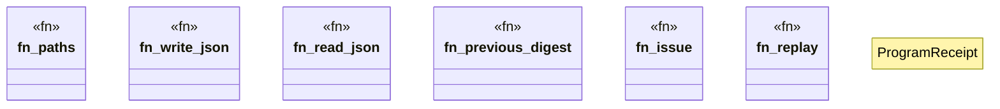

# `crates/ggen-cli/src/cmds/vision2030/receipts.rs`

Source SHA-256: `284c916148c840cc8d2cf42b5cf33d44f092d12cd9b23ece6897d840c8240cd9`

## Dependencies

- `super::*`

## Standing

- Structural parse: `ALIVE`
- Runtime behavior: `UNKNOWN`
