# `crates/ggen-cli/src/cmds/vision2030/tests.rs`

Source SHA-256: `4f5c20e6309bf4ee4ec465c889fd13e656e5ba535b3584c03b020da2c47b5c88`

```mermaid
classDiagram
    class fn_write {
      <<fn>>
    }
    class fn_json_evidence {
      <<fn>>
    }
    class fn_report_digest_value {
      <<fn>>
    }
    class fn_capability_evidence {
      <<fn>>
    }
    class fn_fixture {
      <<fn>>
    }
    class fn_read_manifest {
      <<fn>>
    }
    class fn_write_manifest {
      <<fn>>
    }
    class fn_replace_json_evidence {
      <<fn>>
    }
    class fn_complete_program_reaches_measured_thousand_x {
      <<fn>>
    }
    class fn_shared_sbb_report_digest_cannot_inflate_capabilities {
      <<fn>>
    }
    class fn_divergent_acceptance_refuses_achievement {
      <<fn>>
    }
    class fn_healthcare_actuation_is_refused {
      <<fn>>
    }
    class fn_dependency_cycle_is_refused {
      <<fn>>
    }
    class fn_program_receipts_replay_and_detect_tampering {
      <<fn>>
    }
```

## Dependencies

- `super::*`
- `super::evaluation::evaluate`

## Standing

- Structural parse: `ALIVE`
- Runtime behavior: `UNKNOWN`
