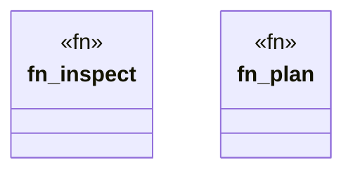

# `crates/ggen-cli/src/cmds/wizard.rs`

Source SHA-256: `30daa2c8c954a1c54f65a57d530d2a9569bbdb3f8098e34243a6a0cd908bd699`

## Dependencies

- `clap_noun_verb::Result`
- `clap_noun_verb_macros::verb`
- `serde_json::Value`
- `std::path::Path`
- `super::maximalism`

## Standing

- Structural parse: `ALIVE`
- Runtime behavior: `UNKNOWN`
