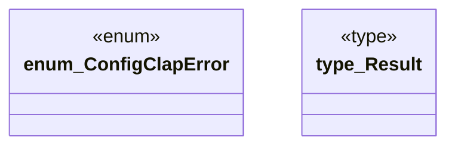

# `crates/ggen-cli/src/config_clap/error.rs`

Source SHA-256: `3eb3631e16a39fa60ed0b3db4f341e25db7282dc498f123284fd9de8f5d8ff12`

## Dependencies

- `thiserror::Error`

## Standing

- Structural parse: `ALIVE`
- Runtime behavior: `UNKNOWN`
