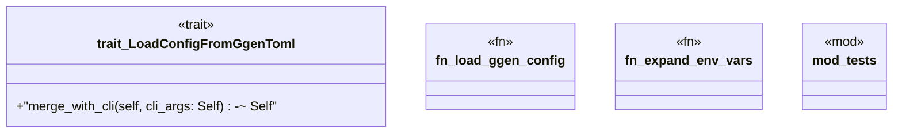

# `crates/ggen-cli/src/config_clap/loader.rs`

Source SHA-256: `c5573e70a36d7f08c10caff4627e71d9dd2d5bd7e0ffa17104d98eb642bb65b8`

## Dependencies

- `crate::config_clap::error::{ConfigClapError, Result}`
- `ggen_config::config_lib::GgenConfig`
- `serial_test::serial`
- `std::env`
- `std::path::Path`
- `super::*`

## Standing

- Structural parse: `ALIVE`
- Runtime behavior: `UNKNOWN`
