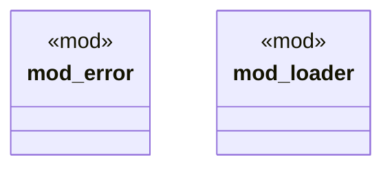

# `crates/ggen-cli/src/config_clap/mod.rs`

Source SHA-256: `ce0fb6774a6e993f623c2b51bd29f69477e501038c07e5082956c328bcccc5c4`

## Dependencies

- `error::ConfigClapError`
- `ggen_config::config_lib as ggen_config_lib`
- `loader::LoadConfigFromGgenToml`

## Standing

- Structural parse: `ALIVE`
- Runtime behavior: `UNKNOWN`
