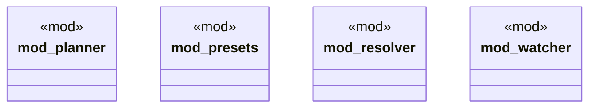

# `crates/ggen-cli/src/conventions/mod.rs`

Source SHA-256: `4e159aac574b2e5308c8574f2436ad48ca5d733e88e462ab1d48df19661c4a3b`

## Dependencies

- `planner::{GenerationPlan, GenerationPlanner, GenerationTask, TemplateMetadata}`
- `presets::ConventionPreset`
- `resolver::{ConventionResolver, ProjectConventions}`
- `watcher::ProjectWatcher`

## Standing

- Structural parse: `ALIVE`
- Runtime behavior: `UNKNOWN`
