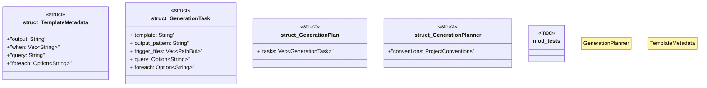

# `crates/ggen-cli/src/conventions/planner.rs`

Source SHA-256: `b7c77bc32e8837d0c3184506f7cdfad0d939cb5b3b2e8cbbd86263dfe3e8d253`

## Dependencies

- `crate::utils::error::Result`
- `std::collections::{HashMap, HashSet}`
- `std::fs`
- `std::path::{Path, PathBuf}`
- `super::*`
- `super::ProjectConventions`
- `tempfile::TempDir`

## Standing

- Structural parse: `ALIVE`
- Runtime behavior: `UNKNOWN`
