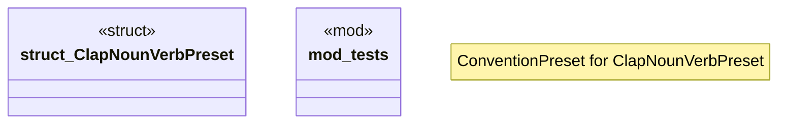

# `crates/ggen-cli/src/conventions/presets/clap_noun_verb.rs`

Source SHA-256: `048e7a5fb5ad0b7314f909bcfb424aa0025abbb2eb37c1417931573a197186ee`

## Dependencies

- `crate::utils::error::Result`
- `std::fs`
- `std::path::Path`
- `super::*`
- `super::ConventionPreset`
- `tempfile::TempDir`

## Standing

- Structural parse: `ALIVE`
- Runtime behavior: `UNKNOWN`
