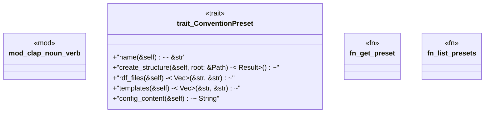

# `crates/ggen-cli/src/conventions/presets/mod.rs`

Source SHA-256: `30baf219d61cd6541062c55ce4565d00841282154a3b5f97ab6767476ed617a2`

## Dependencies

- `crate::utils::error::Result`
- `std::path::Path`

## Standing

- Structural parse: `ALIVE`
- Runtime behavior: `UNKNOWN`
