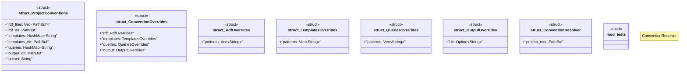

# `crates/ggen-cli/src/conventions/resolver.rs`

Source SHA-256: `09b504573e154088a4cd3d8950f1433837b37be076beb8bcd34010585af146bc`

## Dependencies

- `crate::utils::error::{Context, Result}`
- `glob::glob`
- `serde::{Deserialize, Serialize}`
- `std::collections::HashMap`
- `std::fs`
- `std::path::PathBuf`
- `super::*`
- `tempfile::TempDir`

## Standing

- Structural parse: `ALIVE`
- Runtime behavior: `UNKNOWN`
