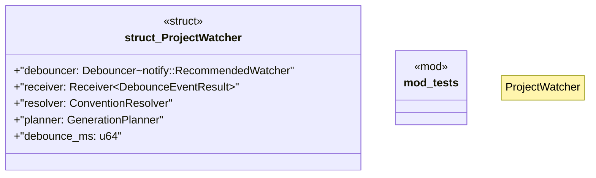

# `crates/ggen-cli/src/conventions/watcher.rs`

Source SHA-256: `3f40781c32fed28fb24b81f995c93db8e4bc5394cd7219a722a068db65b2906e`

## Dependencies

- `crate::utils::error::Result`
- `notify::EventKind`
- `notify::{Event, RecursiveMode, Watcher}`
- `notify_debouncer_full::{new_debouncer, DebounceEventResult, Debouncer, FileIdMap}`
- `std::fs`
- `std::path::{Path, PathBuf}`
- `std::sync::mpsc::{channel, Receiver}`
- `std::time::Duration`
- `super::*`
- `super::planner::{GenerationPlan, GenerationPlanner}`
- `super::resolver::ConventionResolver`
- `tempfile::TempDir`

## Standing

- Structural parse: `ALIVE`
- Runtime behavior: `UNKNOWN`
