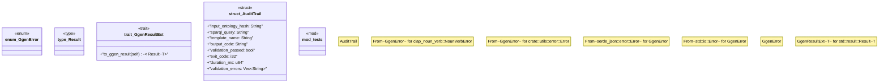

# `crates/ggen-cli/src/error.rs`

Source SHA-256: `1bfa09ddf411a144d870e552429065e411c7f45fd1b641b479e91eb4240cb49c`

## Dependencies

- `super::*`
- `thiserror::Error`

## Standing

- Structural parse: `ALIVE`
- Runtime behavior: `UNKNOWN`
