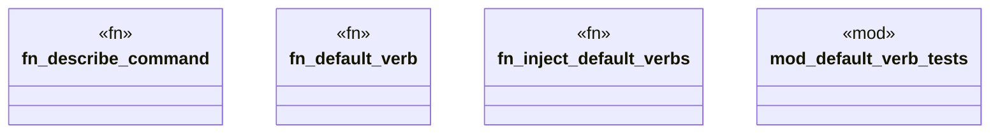

# `crates/ggen-cli/src/generated_commands.rs`

Source SHA-256: `0904d45485f2349681182dd9cb107ef854c1e44a578a2cd3f6646787039c7d04`

## Dependencies

- `super::{inject_default_verbs, DEFAULT_VERBS}`

## Standing

- Structural parse: `ALIVE`
- Runtime behavior: `UNKNOWN`
