# `crates/ggen-cli/src/introspection.rs`

Source SHA-256: `03d50f04e68c0ea4fc0e2e0e3e4c863a86baa08a8f9a5dd943706b7f0faa819e`

```mermaid
classDiagram
    class struct_VerbMetadata {
      <<struct>>
      +"noun: String"
      +"verb: String"
      +"description: String"
      +"arguments: Vec~ArgumentMetadata~"
      +"return_type: String"
      +"supports_json_output: bool"
    }
    class struct_ArgumentMetadata {
      <<struct>>
      +"name: String"
      +"argument_type: String"
      +"optional: bool"
      +"description: String"
      +"default_value: Option~String~"
    }
    class struct_CommandGraph {
      <<struct>>
      +"version: String"
      +"nouns: HashMap~String"
      +"total_verbs: usize"
    }
    class struct_NounDescriptor {
      <<struct>>
      +"description: String"
      +"verbs: Vec~VerbInfo~"
    }
    class struct_VerbInfo {
      <<struct>>
      +"name: String"
      +"description: String"
      +"argument_count: usize"
      +"required_arguments: usize"
    }
    class fn_get_verb_registry {
      <<fn>>
    }
    class fn_get_verb_metadata {
      <<fn>>
    }
    class fn_list_verbs_for_noun {
      <<fn>>
    }
    class fn_build_command_graph {
      <<fn>>
    }
    class mod_tests {
      <<mod>>
    }
```

## Dependencies

- `serde::{Deserialize, Serialize}`
- `std::collections::HashMap`
- `super::*`

## Standing

- Structural parse: `ALIVE`
- Runtime behavior: `UNKNOWN`
