# `crates/ggen-cli/src/lib.rs`

Source SHA-256: `ea164a83caf00f46b3a2a9a85e3a8561ce91420dd0e3149213c051cd325fb2be`

```mermaid
classDiagram
    class mod_agent {
      <<mod>>
    }
    class mod_config_clap {
      <<mod>>
    }
    class mod_error {
      <<mod>>
    }
    class mod_generated_commands {
      <<mod>>
    }
    class mod_pack_install {
      <<mod>>
    }
    class mod_prelude {
      <<mod>>
    }
    class mod_progress {
      <<mod>>
    }
    class mod_scaffolding {
      <<mod>>
    }
    class mod_telemetry {
      <<mod>>
    }
    class mod_utils {
      <<mod>>
    }
    class mod_validation_lib {
      <<mod>>
    }
    class mod_version_checker {
      <<mod>>
    }
    class mod_cmds {
      <<mod>>
    }
    class mod_conventions {
      <<mod>>
    }
    class mod_receipt_manager {
      <<mod>>
    }
    class mod_runtime {
      <<mod>>
    }
    class mod_runtime_helper {
      <<mod>>
    }
    class fn_inject_default_verbs {
      <<fn>>
    }
    class mod_inject_default_verbs_tests {
      <<mod>>
    }
    class struct_RunResult {
      <<struct>>
      +"code: i32"
      +"stdout: String"
      +"stderr: String"
    }
```

## Dependencies

- `clap_noun_verb::{run, Result as ClapNounVerbResult}`
- `crate::utils::error::Result`
- `ggen_engine as _`
- `std::sync::Arc`
- `std::sync::Mutex`
- `super::inject_default_verbs`

## Standing

- Structural parse: `ALIVE`
- Runtime behavior: `UNKNOWN`
