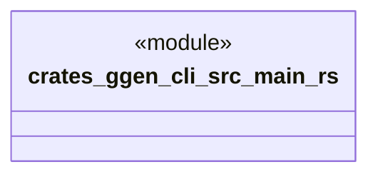

# `crates/ggen-cli/src/main.rs`

Source SHA-256: `ce23727605e8fb9aaecbb9b11e8b3826610fa444c6047ebc86ab86a14c44cb37`

## Dependencies

- None observed.

## Standing

- Structural parse: `ALIVE`
- Runtime behavior: `UNKNOWN`
