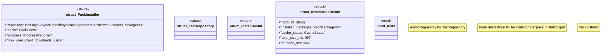

# `crates/ggen-cli/src/pack_install.rs`

Source SHA-256: `074f9ee59a6f372426f2fec886eb2a26323ec746dba711632bd06a69bc1377f7`

## Dependencies

- `async_trait::async_trait`
- `crate::error::GgenError`
- `crate::progress::{CacheStatus, InstallationPlan, PlanStep, ProgressReporter}`
- `futures::future::join_all`
- `ggen_marketplace::marketplace::{ cache::{CacheConfig, CachedPack, PackCache}, error::Error as MarketplaceError, AsyncRepository, Package, PackageId, PackageVersion, }`
- `std::sync::Arc`
- `super::*`
- `tokio::sync::Semaphore`

## Standing

- Structural parse: `ALIVE`
- Runtime behavior: `UNKNOWN`
