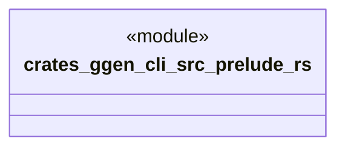

# `crates/ggen-cli/src/prelude.rs`

Source SHA-256: `76947b92653dacaf649b811f1773ef894ae5c3ed638971ec2b9748bacb249896`

## Dependencies

- `clap_noun_verb::Result as ClapNounVerbResult`
- `clap_noun_verb_macros::verb`
- `crate::error::Result`
- `crate::error::{GgenError, GgenResultExt}`
- `crate::runtime_helper`
- `std::fs`
- `std::io::{self, Read, Write}`
- `std::path::PathBuf`

## Standing

- Structural parse: `ALIVE`
- Runtime behavior: `UNKNOWN`
