# `crates/ggen-cli/src/progress.rs`

Source SHA-256: `64d061e9b161342f6f534270b47ca14699293c9bffab4fb66acaa4ad9a736327`

```mermaid
classDiagram
    class struct_ProgressReporter {
      <<struct>>
      +"progress: Arc~Mutex~ProgressState~~"
      +"events: broadcast::Sender~ProgressEvent~"
    }
    class struct_ProgressState {
      <<struct>>
      +"current_step: String"
      +"step_progress: f64"
      +"total_steps: usize"
      +"completed_steps: usize"
      +"current_operation: String"
      +"start_time: Instant"
      +"estimated_duration: Option~Duration~"
      +"bytes_processed: u64"
      +"total_bytes: u64"
      +"items_processed: usize"
      +"total_items: usize"
      +"is_cancelled: bool"
      +"error: Option~String~"
    }
    class enum_ProgressEvent {
      <<enum>>
    }
    class struct_InstallationPlan {
      <<struct>>
      +"pack_id: String"
      +"total_size_mb: f64"
      +"estimated_duration_seconds: u64"
      +"total_dependencies: usize"
      +"steps: Vec~PlanStep~"
      +"cache_status: CacheStatus"
    }
    class struct_PlanStep {
      <<struct>>
      +"step_number: usize"
      +"name: String"
      +"description: String"
      +"estimated_duration_ms: u64"
      +"size_mb: f64"
    }
    class struct_CacheStatus {
      <<struct>>
      +"is_cached: bool"
      +"cached_size_mb: Option~f64~"
      +"cache_hit: bool"
    }
    class struct_ProgressDisplay {
      <<struct>>
      +"reporter: ProgressReporter"
      +"show_detailed: bool"
    }
    class mod_tests {
      <<mod>>
    }
    note "ProgressDisplay"
    note "ProgressReporter"
    note "ProgressState"
```

## Dependencies

- `std::sync::{Arc, Mutex}`
- `std::time::{Duration, Instant}`
- `super::*`
- `tokio::sync::broadcast`
- `tracing::{debug, info, warn}`

## Standing

- Structural parse: `ALIVE`
- Runtime behavior: `UNKNOWN`
