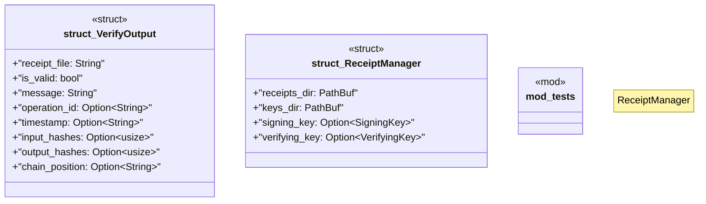

# `crates/ggen-cli/src/receipt_manager.rs`

Source SHA-256: `8b0ac68ad517449857d3fd36735e7f9f964c2eedf2ef84f1f906e9c7a6ef762d`

## Dependencies

- `crate::utils::error::Result`
- `ed25519_dalek::{SigningKey, VerifyingKey}`
- `ggen_config::receipt::{hash_data, Receipt}`
- `serde::Serialize`
- `std::fs`
- `std::path::PathBuf`
- `super::*`
- `tempfile::TempDir`
- `tracing::info`

## Standing

- Structural parse: `ALIVE`
- Runtime behavior: `UNKNOWN`
