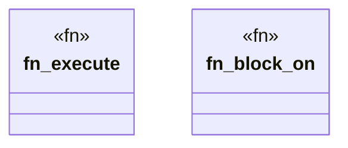

# `crates/ggen-cli/src/runtime.rs`

Source SHA-256: `bfc57998508d43208044d4b916b5d4cd42292456e25072fa7c64cbb0ce6a8dd7`

## Dependencies

- `crate::utils::error::Result`
- `std::future::Future`

## Standing

- Structural parse: `ALIVE`
- Runtime behavior: `UNKNOWN`
