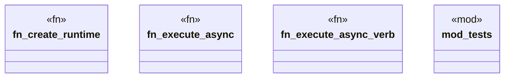

# `crates/ggen-cli/src/runtime_helper.rs`

Source SHA-256: `5844df2a5620a5008892b6b819813d39bd02174f5d9ca9b7dfc9563822223601`

## Dependencies

- `super::*`
- `tokio::runtime::Runtime`

## Standing

- Structural parse: `ALIVE`
- Runtime behavior: `UNKNOWN`
