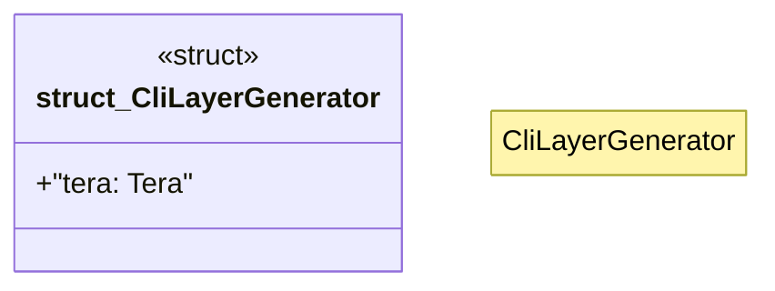

# `crates/ggen-cli/src/scaffolding/cli_generator/cli_layer.rs`

Source SHA-256: `90d2cbca0bd4575719fd1dac943fdb8d099b5ce30447c00a008e6bdbf2c1e44e`

## Dependencies

- `crate::error::{GgenError, Result}`
- `crate::scaffolding::cli_generator::types::{CliProject, Noun, Verb}`
- `std::path::Path`
- `tera::{Context, Tera}`

## Standing

- Structural parse: `ALIVE`
- Runtime behavior: `UNKNOWN`
