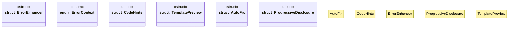

# `crates/ggen-cli/src/scaffolding/cli_generator/dx.rs`

Source SHA-256: `ac06b5bc540c7a5cdaa796c52db40401ef5cbbd6e26615e9169c2d9888e21afb`

## Dependencies

- `crate::error::GgenError`
- `crate::scaffolding::cli_generator::types::{Argument, CliProject, Noun, Verb}`
- `std::fmt::Write`

## Standing

- Structural parse: `ALIVE`
- Runtime behavior: `UNKNOWN`
