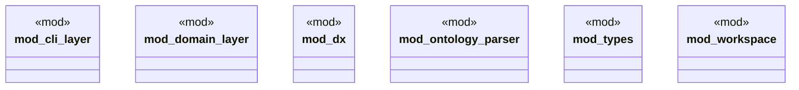

# `crates/ggen-cli/src/scaffolding/cli_generator/mod.rs`

Source SHA-256: `b0e94bfcd26b91ba11f8e223e066bacefc44dd3309bcfe0a5c6ab02eb1227370`

## Dependencies

- `cli_layer::CliLayerGenerator`
- `domain_layer::DomainLayerGenerator`
- `ontology_parser::OntologyParser`
- `types::{Argument, ArgumentType, CliProject, Dependency, Noun, Validation, Verb}`
- `workspace::WorkspaceGenerator`

## Standing

- Structural parse: `ALIVE`
- Runtime behavior: `UNKNOWN`
