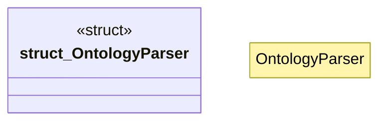

# `crates/ggen-cli/src/scaffolding/cli_generator/ontology_parser.rs`

Source SHA-256: `226d5f9c149d8b8623614113c1950e6cbf82708ee389cb1506396f1b2c74b837`

## Dependencies

- `crate::error::{GgenError, Result}`
- `std::path::Path`

## Standing

- Structural parse: `ALIVE`
- Runtime behavior: `UNKNOWN`
