# `crates/ggen-cli/src/scaffolding/cli_generator/types.rs`

Source SHA-256: `a3014791416a6eee3b89e0ea3512a2ce7e6a4aee7c39b24eaa99b971f00d9b33`

```mermaid
classDiagram
    class struct_CliProject {
      <<struct>>
      +"name: String"
      +"version: String"
      +"description: String"
      +"authors: Vec~String~"
      +"edition: String"
      +"license: String"
      +"nouns: Vec~Noun~"
      +"dependencies: Vec~Dependency~"
      +"cli_crate: Option~String~"
      +"domain_crate: Option~String~"
      +"resolver: String"
    }
    class fn_default_resolver {
      <<fn>>
    }
    class struct_Noun {
      <<struct>>
      +"name: String"
      +"description: String"
      +"module_path: String"
      +"verbs: Vec~Verb~"
    }
    class struct_Verb {
      <<struct>>
      +"name: String"
      +"description: String"
      +"alias: Option~String~"
      +"arguments: Vec~Argument~"
      +"validations: Vec~Validation~"
      +"execution_logic: Option~String~"
      +"domain_function: Option~String~"
      +"domain_module: Option~String~"
    }
    class struct_Argument {
      <<struct>>
      +"name: String"
      +"long: Option~String~"
      +"short: Option~char~"
      +"help: String"
      +"required: bool"
      +"default: Option~String~"
      +"value_name: Option~String~"
      +"position: Option~usize~"
      +"arg_type: ArgumentType"
    }
    class struct_ArgumentType {
      <<struct>>
      +"name: String"
      +"parser: Option~String~"
    }
    class struct_Validation {
      <<struct>>
      +"rule: String"
      +"pattern: Option~String~"
      +"message: String"
      +"arg_name: String"
    }
    class struct_Dependency {
      <<struct>>
      +"name: String"
      +"version: String"
      +"features: Vec~String~"
      +"optional: bool"
    }
```

## Dependencies

- `serde::{Deserialize, Serialize}`

## Standing

- Structural parse: `ALIVE`
- Runtime behavior: `UNKNOWN`
