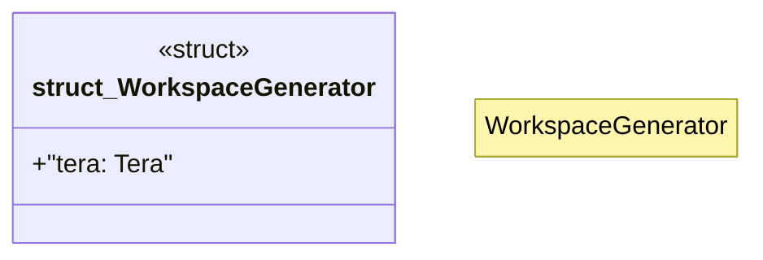

# `crates/ggen-cli/src/scaffolding/cli_generator/workspace.rs`

Source SHA-256: `20c5b2e2d75e3b46fe854f2a381bd2b3548f95d2b0d85f9a27a0884f21279146`

## Dependencies

- `crate::error::{GgenError, Result}`
- `crate::scaffolding::cli_generator::types::CliProject`
- `std::path::Path`
- `tera::{Context, Tera}`

## Standing

- Structural parse: `ALIVE`
- Runtime behavior: `UNKNOWN`
