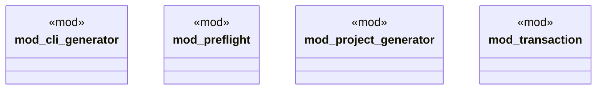

# `crates/ggen-cli/src/scaffolding/mod.rs`

Source SHA-256: `ce18b861198ffd7fbb481d9ffeb074c3c46c00578eae1c75b25680108cd0c60a`

## Dependencies

- None observed.

## Standing

- Structural parse: `ALIVE`
- Runtime behavior: `UNKNOWN`
