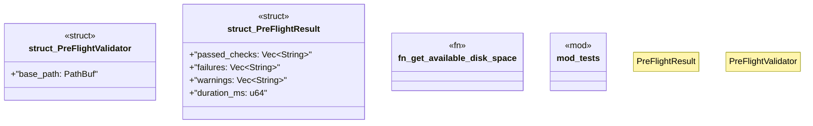

# `crates/ggen-cli/src/scaffolding/preflight.rs`

Source SHA-256: `ab665d78239a0d6f7ea45d67d00e502420806fdc203f85a71a1170ace81f9eb8`

## Dependencies

- `crate::utils::error::{Error, Result}`
- `std::env`
- `std::ffi::OsStr`
- `std::os::windows::ffi::OsStrExt`
- `std::path::{Path, PathBuf}`
- `std::time::Duration`
- `super::*`

## Standing

- Structural parse: `ALIVE`
- Runtime behavior: `UNKNOWN`
