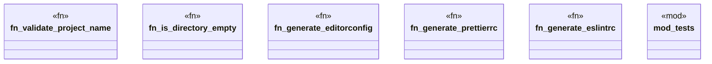

# `crates/ggen-cli/src/scaffolding/project_generator/common.rs`

Source SHA-256: `0656ade368d1f294298076360c5507cd3ea93422581ec376c78e7fead6bafe08`

## Dependencies

- `crate::error::{GgenError, Result}`
- `std::path::Path`
- `super::*`

## Standing

- Structural parse: `ALIVE`
- Runtime behavior: `UNKNOWN`
