# `crates/ggen-cli/src/scaffolding/project_generator/mod.rs`

Source SHA-256: `70ada7b0e8955063afae65acc33d47b79e24b53812d75e8d6892f0b4cff3b78b`

```mermaid
classDiagram
    class mod_common {
      <<mod>>
    }
    class mod_nextjs {
      <<mod>>
    }
    class mod_rust {
      <<mod>>
    }
    class mod_safe_command {
      <<mod>>
    }
    class enum_ProjectType {
      <<enum>>
    }
    class struct_ProjectConfig {
      <<struct>>
      +"name: String"
      +"project_type: ProjectType"
      +"framework: Option~String~"
      +"path: PathBuf"
    }
    class struct_ProjectStructure {
      <<struct>>
      +"files: Vec~(String"
      +"directories: Vec~String~"
    }
    class trait_ProjectGenerator {
      <<trait>>
      +"generate(&self, config: &ProjectConfig) -~ Result~ProjectStructure~"
      +"supported_types(&self) -~ Vec~ProjectType~"
    }
    class struct_GeneratorFactory {
      <<struct>>
    }
    class struct_FileSystemWriter {
      <<struct>>
    }
    class struct_GitInitializer {
      <<struct>>
    }
    class struct_DependencyInstaller {
      <<struct>>
    }
    class mod_tests {
      <<mod>>
    }
    note "Default for DependencyInstaller"
    note "Default for FileSystemWriter"
    note "Default for GitInitializer"
    note "DependencyInstaller"
    note "FileSystemWriter"
    note "GeneratorFactory"
    note "GitInitializer"
    note "std::fmt::Display for ProjectType"
    note "std::str::FromStr for ProjectType"
```

## Dependencies

- `crate::error::{GgenError, Result}`
- `crate::scaffolding::project_generator::safe_command::SafeCommand`
- `std::path::{Path, PathBuf}`
- `super::*`

## Standing

- Structural parse: `ALIVE`
- Runtime behavior: `UNKNOWN`
