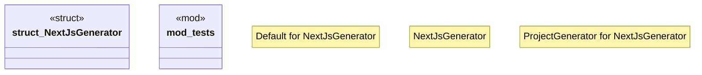

# `crates/ggen-cli/src/scaffolding/project_generator/nextjs.rs`

Source SHA-256: `b0282796c8779d99e74a47dca93b70a4ba9d8ba1a3115f91cae4706ea6ce4efe`

## Dependencies

- `crate::error::Result`
- `std::path::PathBuf`
- `super::*`
- `super::{ProjectConfig, ProjectGenerator, ProjectStructure, ProjectType}`

## Standing

- Structural parse: `ALIVE`
- Runtime behavior: `UNKNOWN`
