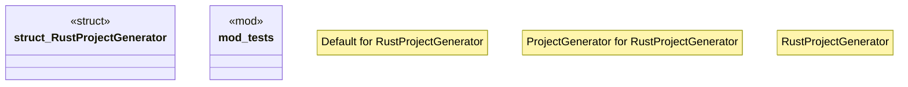

# `crates/ggen-cli/src/scaffolding/project_generator/rust.rs`

Source SHA-256: `ab09eb5a81c2423f46f1c7d31bd5768bff545b287fe7013e35452242e3fcfc5a`

## Dependencies

- `crate::error::Result`
- `std::path::PathBuf`
- `super::*`
- `super::{ProjectConfig, ProjectGenerator, ProjectStructure, ProjectType}`

## Standing

- Structural parse: `ALIVE`
- Runtime behavior: `UNKNOWN`
