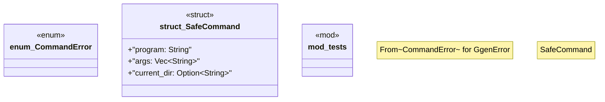

# `crates/ggen-cli/src/scaffolding/project_generator/safe_command.rs`

Source SHA-256: `1e945145b568ce1746a9f5be81c15fa7da6dfcc998e4d0b4b7cbc4647478e512`

## Dependencies

- `crate::error::{GgenError, Result}`
- `std::path::Path`
- `std::process::{Command, Output}`
- `super::*`

## Standing

- Structural parse: `ALIVE`
- Runtime behavior: `UNKNOWN`
