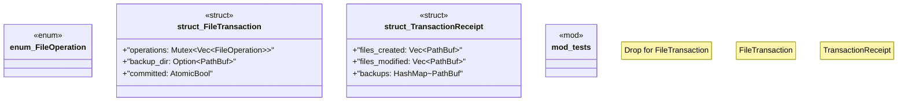

# `crates/ggen-cli/src/scaffolding/transaction.rs`

Source SHA-256: `fc976cd347dc9c1e119d138ab2c4cee5d43d3125ee7088513f8c174d3a09ada1`

## Dependencies

- `crate::utils::error::{Error, Result}`
- `parking_lot::Mutex`
- `std::collections::HashMap`
- `std::fs`
- `std::io::Write`
- `std::path::{Path, PathBuf}`
- `std::sync::atomic::{AtomicBool, Ordering}`
- `super::*`
- `tempfile::NamedTempFile`
- `tempfile::tempdir`

## Standing

- Structural parse: `ALIVE`
- Runtime behavior: `UNKNOWN`
