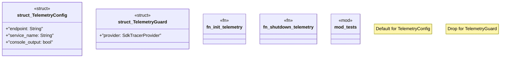

# `crates/ggen-cli/src/telemetry.rs`

Source SHA-256: `8986af896e524f068b7ac83d0c956989e82b5a847abec358ec53b4ab98d706ce`

## Dependencies

- `crate::utils::error::{Error, Result}`
- `opentelemetry::{global, KeyValue}`
- `opentelemetry_otlp::WithExportConfig`
- `opentelemetry_sdk::Resource`
- `opentelemetry_sdk::trace::SdkTracerProvider`
- `super::*`
- `tracing_subscriber::{layer::SubscriberExt, util::SubscriberInitExt, EnvFilter, Registry}`

## Standing

- Structural parse: `ALIVE`
- Runtime behavior: `UNKNOWN`
