# `crates/ggen-cli/src/utils/error.rs`

Source SHA-256: `10a7840165c8494ad9f498c4b7ff847560f0da70dea010b897947c88bdd9330f`

```mermaid
classDiagram
    class struct_Error {
      <<struct>>
      +"message: String"
      +"context: Option~String~"
      +"source: Option~Box~dyn StdError + Send + Sync~~"
    }
    class type_Result {
      <<type>>
    }
    class trait_Context {
      <<trait>>
    }
    class mod_tests {
      <<mod>>
    }
    note "Context~T~ for Result~T~"
    note "Error"
    note "From~"
    note "From~String~ for Error"
    note "From~anyhow::Error~ for Error"
    note "From~log::SetLoggerError~ for Error"
    note "From~oxigraph::sparql::QueryEvaluationError~ for Error"
    note "From~oxigraph::store::SerializerError~ for Error"
    note "From~oxigraph::store::StorageError~ for Error"
    note "From~serde_json::Error~ for Error"
    note "From~serde_yaml::Error~ for Error"
    note "From~std::io::Error~ for Error"
    note "From~std::sync::PoisonError~T~~ for Error"
    note "From~tera::Error~ for Error"
    note "From~toml::de::Error~ for Error"
    note "From~toml::ser::Error~ for Error"
    note "StdError for Error"
    note "fmt::Display for Error"
```

## Dependencies

- `std::error::Error as StdError`
- `std::fmt`
- `super::*`

## Standing

- Structural parse: `ALIVE`
- Runtime behavior: `UNKNOWN`
