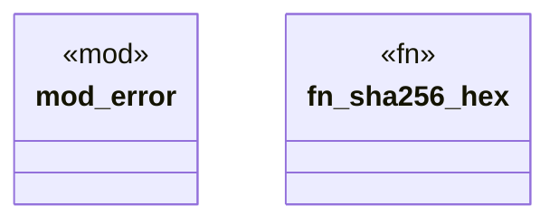

# `crates/ggen-cli/src/utils/mod.rs`

Source SHA-256: `8c1580f4363d92778c88b10bbccda4634392e678fea545dd12e238da37d89eb0`

## Dependencies

- `error::{Context, Error, Result}`
- `sha2::{Digest, Sha256}`

## Standing

- Structural parse: `ALIVE`
- Runtime behavior: `UNKNOWN`
