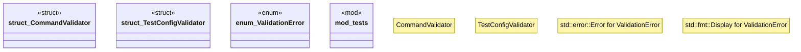

# `crates/ggen-cli/src/validation/mod.rs`

Source SHA-256: `f3882f3e4b73f2d3225577cae7e5e7ca17aa301b373827cca6b116ffbe624a7d`

## Dependencies

- `$crate::validation::CommandValidator`
- `std::collections::HashMap`
- `std::path::Path`
- `super::*`

## Standing

- Structural parse: `ALIVE`
- Runtime behavior: `UNKNOWN`
