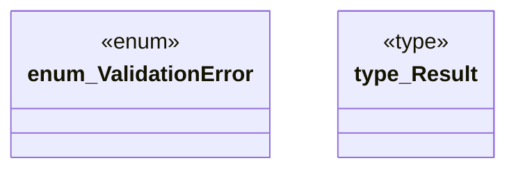

# `crates/ggen-cli/src/validation_lib/error.rs`

Source SHA-256: `17fec7d145a64eec741b1e90b60897be2a9944ef57dd5ec35d95ebf52098a97e`

## Dependencies

- `thiserror::Error`

## Standing

- Structural parse: `ALIVE`
- Runtime behavior: `UNKNOWN`
